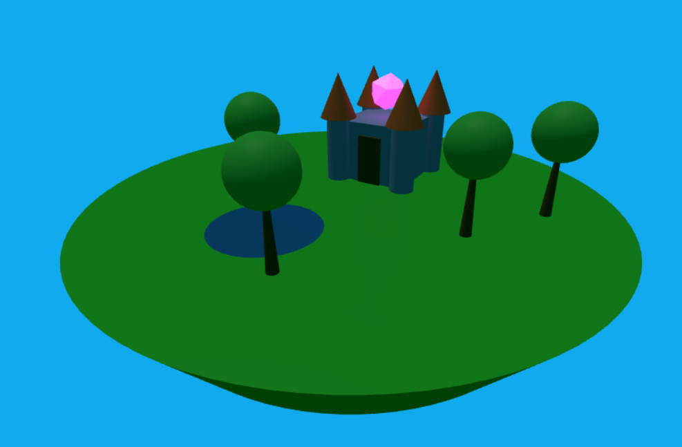

# Sistemas Gráficos FIUBA

Los trabajos prácticos de esta cursada se realizan con Three.js.

## TP1: Castillo

En este trabajo práctico se aprende sobre cómo renderizar una escena, transformaciones básicas, tipos de luces, primitivas y la estructura de las escenas.

